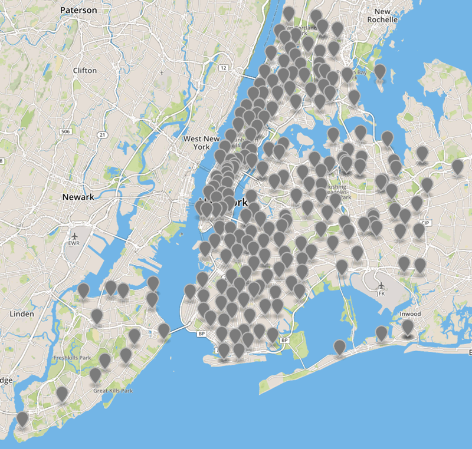

# NYC Libraries Map

## Map of libraries in NYC
Based on [311 online facility finder](http://www1.nyc.gov/apps/311utils/facilityFinderResults.htm?requestType=&serviceName=Libraries&viewType=SHOWALL&type=Library&serviceId=1967#), geocoded with [Mapzen](https://mapzen.com/products/search/) and by hand.

### [See the map](map-libraries.geojson)

### [Get the CSV](spreadsheet-libraries.csv)

This list is semi-accurate. Pull requests are welcome!

